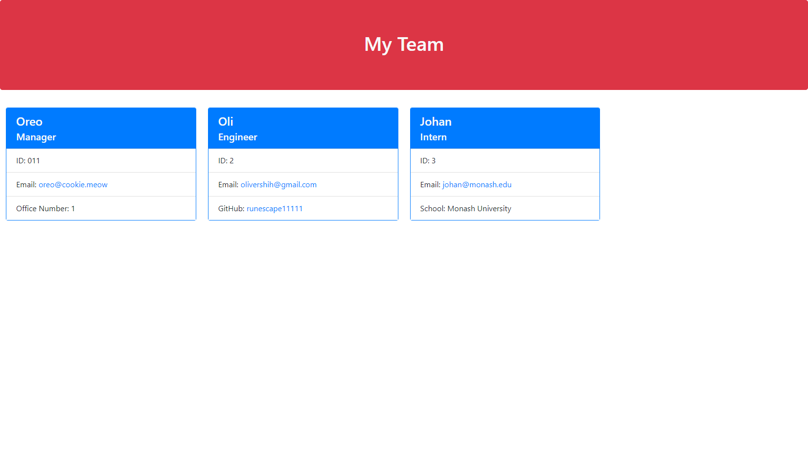

# Team Profile Generator
## 
## Table of Contents
- [Description](#Description)
- [Installation Instructions](#Installation-Instructions)
- [Usage Information](#Usage-Information)
- [Contribution Guidelines](#Contribution-Guidelines)
- [Test Instructions](#Test-Instructions)
- [Questions](#Questions)
## Description
This is a team profile generator. The user can input numerous team members with names, ids, roles, and many more, and the information will be printed to a html file with formatting and styling.
## Installation Instructions
```
npm i
```
## Usage Information
The user will be asked first to provide information for the team manager. Upon finishing, the user can opt to add engineer, intern, or stop. If another member is to be added, further information will be required, and after every subsequent member added, the user will be prompted again if more members are needed. When the final member is included, the html output can be found in ./dist/team.html for the user to inspect.
## Sample Page

## Contribution Guidelines
N/A
## Test Instructions
```
npm test
```
## Video Link
https://drive.google.com/file/d/143O1W_ristOniquYqRn7tfRFlUo5VwpX/view?usp=sharing
## Questions
GitHub profile: github.com/runescape11111/

Email: olivershih@gmail.com
